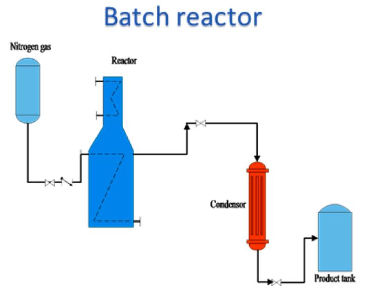

# Plastic Pyrolysis

Paper (Dai et al) says that the conditions are:

* 300C - 900C
* Open vent pressure to slightly above atmospheric

Also mention that the simplest type of reactor is a "Batch reactor"
operating at 500C for 30min.

See Image:

